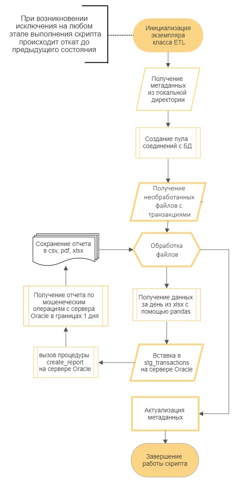

# Проект инкрементальной загрузки транзакций на сервер базы данных Oracle для их проверки на факт совершения мошеннических действий
:atm: 🔍💰
# Про проект:
### <p  style = "text-indent: 15px;">Учебный проект по созданию ETL-процесса.</p>
# Особенности:
 - ### написан на Python и PL/SQL
 - ### простота структуры приложения
 - ### использование шаблонизатора Jinja и библиотеки Pandas для создания отчетов 
 - ### реализован принцип "все или ничего" в обработке транзакций
 - ### логирование
 - ### упрощенная структура PL/SQL-пакета
 - ### инкапсуляция доступа к PL/SQL-процедурам
 - ### уклон в сторону автоматизации процесса
# Блок-схема приложения:

# Для запуска приложения понядобятся:
 * [Python 3.9.6](https://www.python.org/downloads/release/python-396/)
 * [Pandas 1.3.4](https://pypi.org/project/pandas/)
 * [OpenPyXl 3.0.9](https://pypi.org/project/openpyxl/)
 * [cx-Oracle 8.3.0](https://pypi.org/project/cx-Oracle/)
 * [PDFKit 0.6.1](https://pypi.org/project/pdfkit/)
 * [wkhtmltopdf](https://wkhtmltopdf.org/downloads.html)
 * [Jinja2 3.0.3](https://pypi.org/project/Jinja2/)
# Настройка проекта
 - ### установить необходимые зависимости
 - ### сконфигурировать <i>config_db.py</i>
     ```python
    config_db = {
        'user': '<randomuser>',
        'password': '<randompassword>',
        'host': '<randomhost>',
        'port': '<randomport>',
        'SID': '<randomSID>',
    }
    ```
 - ### загрузить <i>ddl.sql</i> и <i>etl.sql</i>  из папки <i>sql_libary</i> с помощью SQLDeveloper, PL/SQL Developer или через SQL*Plus в рабочую схему базы данных Oracle
 # Запуск проекта
 - ### в папку transactions добавить новые транзакции
 - ### запустить run.py
 - ### дождаться уведомления о завершении работы скрипта
 - ### забрать в папке reports новые отчеты
  ### или настроить планировщик задач
 # Если что-то пошло не так...
 - ### повторно запустите run.py
 - ### если ошибка сохраняется, то позовите системного администратора, который просмотрит логи в <i>etl_logging.log</i> для выяснения проблемы